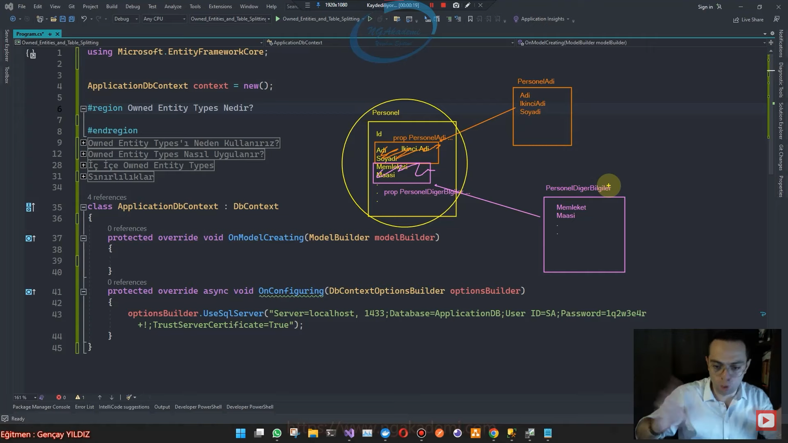
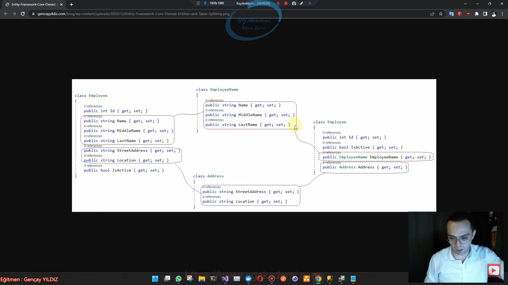

# Owned Entity Types Nedir?

- Bir olguya karşılık gelen o olguyu modelleyen, nesne/sınıf Entity'dir.

- Entity'de ilgili hedef olgu her neyse onu modelleyecek tüm property'leri tek tek yerleştiriyoruz.

- Bizler bazen entity'lerimizi içerisindeki property'lerin kavramsal olarak birbirlerine yakın olacak şekilde kümelenip ayrı sınıflarda temsil edilmesini isteyebiliriz.

- Bir entity'deki belirli property'leri kümesel olarak farklı sınıflara aktarıyoruz ve o sınıflardan personeli çekmeye çalışıyoruz.

- Bir entity'nin içerisinde özellikleri kümesel olarak farklı sınıflara aktarmamızı sağlayan yapılanmaya biz Owned Entity Types(Sahip Olunan Entity Türleri) diyoruz.

- Kümelenmiş özellikleri barındıran sınıfları birer entity olarak düşünebilirsiniz. Amma velakin gerçek olan Entity tarafından sahip olunan entity'lerdir. Yani buradaki entity'ler bir tabloya karşılık olarak gelen entity'ler değil bunların içerisindeki property'ler Asıl entity tarafından kullanılacağı için sahip olunan/owned entity olarak nitelendirilir.



- EF Core entity'lerimizi parçalayarak kümesel olarak bilgileri farklı sınıflarda tutmamızı sağlayabilmektedir.

- EF Core entity sınıflarını parçlayarak, property'lerini kümesel olarak farklı sınıflarda barındırmamıza ve tüm bu sınıfları ilgili entity'de birleştirip bütünsel olarak çalışmamıza izin vermektedir.

- Bir entity'de olması gereken bilgileri farklı sınıflara aktarıyoruz ya o sınıfları bu entity'de kullanıyorsa ki eğer bu sınıflar sahiplenilmiş mal olarak kullanılmış sınıflar olacaktır.

- Böylece bir entity, sahip olunan(owned) birden fazla alt sınıfın birleşmesiyle meydana gelebilmektedir.

- Yani biz bir entity oluştururken bu entity'de property'leri yakın kavramsal kümelenebilir property'lerini farklı sınıflara aktararak bu entity'nin hacmini küçültüp Owned Entity Types özelliği ile parçalayıp bir bütün olarak kullanabiliriz.



# Owned Entity Types'ı Neden Kullanırız?

- Domain Driven Design(DDD) yaklaşımında Value Object'lere karşılık olarak Owned Entity Types'lar kullanılır!

- Value Object yapılanması herhangi bir primary key'i olmayan ve değeri değişmeyen yapılanmalardır. Bunun gibi yapılanmaları EF Core üzerinden ve Domain Driven Design kullanıyorsak o yaklaşımı benimsiyorsak bunun gibi yaklaşımları inşa edebilmek için EF Core'un bu özelliğinden istifade ederiz.

- Value Object kavramlarına karşılık EF Core'daki muadili Owned Entity Types davranışıdır.

# Owned Entity Types Nasıl Uygulanır?

- Normal bir entity'de farklı sınıfların referans edilmesi primary key vs. gibi hatalara sebebiyet verecektir. Çünkü direkt bir sınıfın referans olarak alımnası EF Core tarafından ilişkisel bir tasarım olarak algılanır. Bizlerin entity içerisindeki property'leri kümesel olarak barındıran sınıfları o entity'nin bir parçası olduğunu bildirmemiz özellikle gerekmektedir.

# OwnsOne Metodu

```C#
protected override void OnModelCreating(ModelBuilder modelBuilder)
{
   modelBuilder.Entity<Employee>().OwnsOne(e => e.EmployeeName, builder =>
   {
       builder.Property(e => e.Name).HasColumnName("Name");
   });
   modelBuilder.Entity<Employee>().OwnsOne(e => e.Address);
}
```

# Owned Attribute'u

```C#
[Owned]
class EmployeeName
{
   public string Name { get; set; }
   public string MiddleName { get; set; }
   public string LastName { get; set; }
}
[Owned]
class Address
{
   public string StreetAddress { get; set; }
   public string Location { get; set; }
}
```

# IEntityTypeConfiguration<T> Arayüzü

```C#
class EmployeeConfiguration : IEntityTypeConfiguration<Employee>
{
   public void Configure(EntityTypeBuilder<Employee> builder)
   {
       builder.OwnsOne(e => e.EmployeeName, builder =>
       {
           builder.Property(e => e.Name).HasColumnName("Name");
       });
       builder.OwnsOne(e => e.Address);
   }
}
protected override void OnModelCreating(ModelBuilder modelBuilder)
{
   modelBuilder.ApplyConfiguration(new EmployeeConfiguration());
}
```

# OwnsMany Metodu

- OwnsMany metodu, entity'nin farklı özelliklerine başka bir sınıftan ICollection türünde Navigation Property aracılığıyla ilişkisel olarak erişebilmemizi sağlayan bir işleve sahiptir.

- Eğer ki bire çok ilişki kurulacaksa burada herhangi bir DbSet property'si tanımlamadan yapmak istiyorsak OwnsMany metodunu kullanabiliriz.

- Normalde Has ilişkisi olarak kurulabilecek bu ilişkinin temel farkı, Has ilişkisi DbSet property'si gerektirirken, OwnsMany Metodu ise DbSet'e ihtiyaç duymaksızın buradaki davranışı gerçekleştirmemizi sağlamaktadır.

- Sahiplenilmiş bir entity olarak tasarlamak istiyorsak ve bunu bire çok bir ilişki türünden yürütmek istiyorsak herhangi bir Nabvigation Property koymayacağız. Bunu yapabilmek için Principal entity hangisiyse orada ICollection olarak yine de referans etmeliyiz.

```C#
var d = await context.Employees.ToListAsync();
Console.WriteLine();
class Employee
{
   public int Id { get; set; }
   public bool IsActive { get; set; }

   public EmployeeName EmployeeName { get; set; }
   public Address Address { get; set; }

   public ICollection<Order> Orders { get; set; }
}
class Order
{
   public string OrderDate { get; set; }
   public int Price { get; set; }
}

protected override void OnModelCreating(ModelBuilder modelBuilder)
{
   modelBuilder.Entity<Employee>().OwnsMany(e => e.Orders, builder =>
   {
       builder.WithOwner().HasForeignKey("OwnedEmployeeId");
       builder.Property<int>("Id");
       builder.HasKey("Id");
   });
}
```

# Sınırlılıklar

- Herhangi bir Owned Entity Type için DbSet property'sine ihityaç yoktur kullanamazsınız.

- OnModelCreating fonksiyonunda Entity<T> metodu ile Owned Entity Type türünden bir sınıf üzerinde herhangi bir konfigürasyon gerçekleştirilemez! OwnsOne ya da OwnsMany fonksiyonlarında gerçekleştireceksiniz

- Owned Entity Type'ların kalıtımsal hiyerarşi desteği yoktur.

# Entity & DbContext

```C#
class Employee 
{
    public int Id { get; set; }
    //public string Name { get; set; }
    //public string MiddleName { get; set; }
    //public string LastName { get; set; }
    //public string StreetAddress { get; set; }
    //public string Location { get; set; }
    public bool IsActive { get; set; }

    public EmployeeName EmployeeName { get; set; }
    public Address Address { get; set; }

    public ICollection<Order> Orders { get; set; }
}
class Order
{
    public string OrderDate { get; set; }
    public int Price { get; set; }
}
//[Owned]
class EmployeeName
{
    public string Name { get; set; }
    public string MiddleName { get; set; }
    public string LastName { get; set; }
}
//[Owned]
class Address
{
    public string StreetAddress { get; set; }
    public string Location { get; set; }
}


class ApplicationDbContext : DbContext
{
    public DbSet<Employee> Employees { get; set; }
    protected override void OnModelCreating(ModelBuilder modelBuilder)
    {
        #region OwnsOne
        //modelBuilder.Entity<Employee>().OwnsOne(e => e.EmployeeName, builder =>
        //{
        //    builder.Property(e => e.Name).HasColumnName("Name");
        //});
        //modelBuilder.Entity<Employee>().OwnsOne(e => e.Address);
        #endregion
        #region OwnsMany
        modelBuilder.Entity<Employee>().OwnsMany(e=>e.Orders, builder =>
        {
            builder.WithOwner().HasForeignKey("OwnedEmployeeId");
            builder.Property<int>("Id");
            builder.HasKey("Id");
        });
        #endregion

        modelBuilder.ApplyConfiguration(new EmployeeConfiguration());
    }

    protected override void OnConfiguring(DbContextOptionsBuilder optionsBuilder)
    {
        optionsBuilder.UseSqlServer("Server=localhost, 1433;Database=ApplicationDB; User ID=SA; Password=1q2w3e4r!.; TrustServerCertificate=True;");
    }
}

class EmployeeConfiguration : IEntityTypeConfiguration<Employee>
{
    public void Configure(EntityTypeBuilder<Employee> builder)
    {
        builder.OwnsOne(e => e.EmployeeName, builder =>
        {
            builder.Property(e => e.Name).HasColumnName("Name");
        });
        builder.OwnsOne(e => e.Address);
    }
}
```
