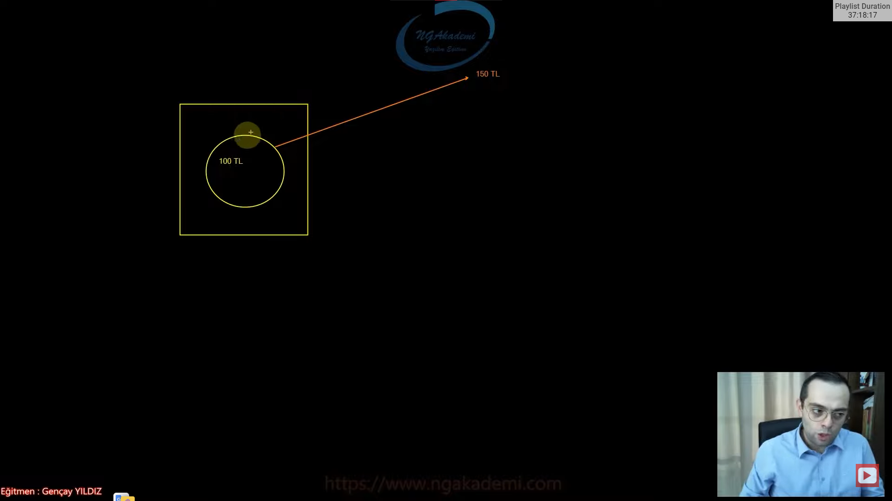

# Data Concurrency Nedir?
- Veri tutarlılığı demektir.

- Yazılım süreçlerinde veri tutarsızlık durumlarını yönetebilmemizi sağlar.

- Geliştirdiğimiz uygulamalarda ister istemez verisel tutarsızlıklar meydana gelebilmektedir. Örneğin birden fazla uygulamanın yahut client'ın aynı veritabanı üzerinde eş zamanlı olarak çalıştığı durumlarda verisel anlamda uygulamadan uygulamaya yahut client'tan client'a tutarsızlıklar meydana gelebilir.

- Data Concurrency kavramı, uygulamalardaki veri tutarsızlığı durumalrına karşılık yönetilebilirliği sağlayacak olan davranışları kapsayan bir kavramdır.

- Bir uygulama da veri tutarsızlığı olması demek o uygulamayı kullanan kullanıcıları yanıltmak demektir.

- Veri tutarsızlığının olduğu uygulamalarda istatiksel olarak yanlış sonuçlar elde edilebilir...

- Bir E-Ticaret sitesinden alışveriş yaptığımızı varsayalım burada alışveriş yaparken gelen ekranda ürün 100₺ olarak gözükmektedir. Amma velakin tam o sırada bu ürünü kontrol eden bir Client ise diğer tarafta ürünün fiyatını güncellemekte ve bu durumda ürünün fiyatı 150₺ olmaktadır. İşte burada veri tutarsızlığı meydana gelmektedir. İşte bu tür zamanlarda kullanıcılara bu tutarsız olan veriler üzerinde işlem yapmaya izin vermemeliyiz.

- Aslında bunlara en güzel örnek market raflarındaki ürünlerde verilebilir. Marketlerde raflardaki fiyatlara baktığımızda ürünün fiyatı 10₺ yazıyor iken bir çok zaman market işletmecileri tarafından değiştirilmeyen fiyat etiketleri sebebiyle kasada farklı fiyatlar karşımıza çıkabilmektedir. 10₺ yazan ürün 20₺ olabilir mesela.

- Veri tutarlılığını sağlamak demek tutarsız verilerin garantisini almak demek değildir.

- Benim uygulamamda kesinlikle tutarısız veri olamaz diyemeyiz. Bunu sağlayabilmek için ciddi manada maliyetli çalışmalar yapmamız gerekir her uygulama için ekstradan soketsel çalışmalar yapmamız gerekir anlık güncellemeler yapmamız gerekir eventleri sağlamamız lazım falan filan. Bu kadar kompleks çalışmalar yapmaktansa en son çalışılan verilerin tutarlı veri olup olmadığını denetleyecek yöntemlere başvurmamız yeterli olacaktır.



# Stale & Dirty (Bayat & Kirli) Data Nedir?
- Stale Data : Veri tutarsızlığına sebebiyet verebilecek güncellenmemiş yahut zamanı geçmiş olan verileri ifade etmektedir. Örneğin bir ürünün stok durumu sıfırlandığı halde arayüz üzerinde bunu ifade eden bir güncelleme durumu söz konusu değilse işte bu stale data durumuna bir örnektir.

- Dirty Data : Veri tutarsızlığına sebebiyet verebilecek verinin hatalı yahut yanlış olduğunu ifade etmektedir. Örneğin adı 'Ahmet' olan bir kullanıcının veritabanında 'Mehmet' olarak tutulması dirty data örneklendirmesidir. 

# Last In Wins (Son Gelen Kazanır)
- Veri tutarsızlığına mahal verebilecek davranışların olduğu uygulamalarda artık en sonuncu veri neyse o veri geçerliliğini koruyacaktır.

- Bir veritabanı inşa ettik ve bu veritabanında ben telefon üzerinden değişiklik yapıyorum sen browser üzerinden yapıyorsun öbürü de tablet üzerinden yapıyor.Ben burada yapmış olduğum değişiklikleri sen anlık olarak eğer ki arada socket falan kullanmıyorsak anlık olarak göremiyorsun. Haliyle sen de değişiklikler yapıyorsun. Senin bir kolon üzerinde bir satırın üzerinde yapmış olduğun değişikliği ben burada göremiyorum bende bir değişiklik yapıyorum sende onu göremiyorsun artık hangimiz en son değişiklik yaptıysak o kazanmış oluyor.

- Esasında veri yönetim yöntemidir Last In Wins denilen yapılanma.

- Bir veri yapısında son yapılan aksiyona göre en güncel verinin en üstte bulunmasını/varlığını korumasını ifade eden bir deyimsel terimdir.

# Pessimistic Lock (Kötümser Kilitleme)
- Bu yöntem EF Core tarafından birebir destelenen bir member tarafından işlenebilen bir yöntem değildir. Bunu biz dolaylı yoldan sağlayabiliyoruz.

- Veritabanında bir veri üzerinde çalışıyorsak eğer öncelikle çalışma yapacağımız verileri sorgularla elde ediyoruz. Elde ettiğimiz bu verilerin üzerinde işlem yaparken bu transaction sürecinde bu satırın üzerindeki herhangi bir kolonda değişiklik yapılmasını istemiyorsak bizler bu veriyi kitliyoruz. İşte bu kitlemeye Pessimistic Lock denmektedir. 

- Yani bir başka deyişle bir transaction sürecinde elde ettiğimiz verilerin üzerinde farklı sorgularla değişiklik yapılmasını istemiyorsak eğer ilgili verileri Lock yöntemiyle Pessimistic Lock yöntemiyle kilitleyerek değişikliğe karşı direncini sağlamış oluyoruz.

- Bir transaction sürecinde elde edilen veriler üzerinde farklı sorgularla değişiklik yapılmasını engellemek için ilgili verilerin kitlenmesini(locking) sağlayarak değişikliğe karşı direnç oluşturulmasını ifade eden bir yöntemdir.

- Geçerlilik süreci ilgili transaction'daki transaction sürecini commit ya da rollback ile sonlandırılması tarafı için geçerlidir.

- Bu verilern kilitlenmesi durumu ilgili transaction'ın commit ya da rollback edilmesi ile sınırlıdır.
# Deadlock Nedir? - Kilitleme Çıkmazı - Ölüm Kilitlenmesi Nedir?
- Kilitlenmiş olan bir verinin veritabanı seviyesinde meydana gelen sistemsel bir hatadan dolayı kilidinin tekrardan çözülememesi durumudur. Ya da bir başka deyişle Veritabanında yapılan kilitlenmelerin döngüsel olarak tekrar etmesi durumudur. Yani bir döngüdür. Yani bir kilitten çıkamama durumudur. Haliyle veritabanını resetlemediğiniz sürece işin içinden çıkamayacağınız bir durumu ifade etmektedir.

- Eğer ki Pessimistic Lock yöntemini kullanıyorsanız eğer bu durum her daim risk durumu olarak değerlendirilmelidir.

- Kitlenmiş olan bir verinin veritabanı seviyesinde meydana gelen sistemsel bir hatadan dolayı kilidinin çözülememesi yahut döngüsel olarak kilitlenme durumunun meydana gelmesini ifade eden bir terimdir.

- Pessimistic Lock yönteminde Deadlock durumunu yaşamanız bir ihtimaldir. O yüzden değerlendirilmesi gereken ve iyi düşünülerek tercih edilmesi gereken bir yaklaşımdır Pessimistic Lock yaklaşımı.

# WITH (XLOCK)
- Gelecek olan veriler üzerinde farklı bir değişikliği farklı bir sorgu/aksiyon üzerinden değişiklik yapılmasını engelleyecek yani ilgili verileri kitleyecek SQL Server'da kullanılan bir keyworddür.

```C#
var transaction = await context.Database.BeginTransactionAsync();
var data = await context.Persons.FromSql($"SELECT * FROM Persons WITH (XLOCK) WHERE PersonID=5").ToListAsync();
Console.WriteLine();
await transaction.CommitAsync();
```

# Optimistic Lock (İyimser Kilitleme)
- EF Core tarafından desteklenen dahili olarak kendi içerisinde bununla ilgili yapılanmalar getiren buna göre bir davranışı benimseyen bir niteliğe sahiptir.

- Veritabanı seviyesinde herehangi bir kitleme söz konusu değildir.

- Optimistic Lock'ta üzerinde çalışılan verilerle tutarsızlığa mahal verebilecek değişikliklere izinler veriliyor. Pessimistic Lock'ta belki veri kilitlendiği için herhangi bir tutarsızlığa mahal verebilecek değişikliğe bile şansımız yokken Optimistic Lock'ta veriyi değiştirebiliyorsunuz. Yani ekranda gözüken 100 değerini arka planda 150 200 olarak değiştirebiliyorsunuz.

- Ama Optimistic Lock yönteminde her bir veriye karşılık bir versiyon numarası/versiyon bilgisi çıkarılıyor. Ve verinin üzerinde bir değişiklik olduğu taktirde bu versiyon bilgisi değiştiriliyor. Otomatik olarak yeni bir versiyon bilgisi Generate ediliyor dolayısıyla EF Core üzerinden biz Optimistic Lock'ı kullanırsak eğer inMemory'e alacağımız verilerinde versiyon bilgilerini alıyoruz ve yapacağımız işlemlerde veritabanındakiyle inmemory'deki versiyon bilgilerini karşılaştırarak eğer doğrulama gerçekleştiriliyorsa demek ki bu veri üzerinde herhangi bir tutarsızlığa mahal verebilecek değişiklik yapılmadığını anlayarak işleme o oradaki artık operasyon her neyse ona izin veriyoruz. Yok eğer versiyon bilgileri tutmuyorsa demek ki burada tutarsızlık söz konusu öyle bir durumda da hata fırlatıyoruz. Bu şekilde tutarsızlığın olabileceği senaryolara karşılık bir davranış geliştirmiş oluyoruz.

- Yani buradaki anahtar sözcük her bir veriye karşılık oluşturulan versiyondur.

- Bir verinin stale olup olmadığını anlamak için herahngi bir verinin locking işlemi olmaksızın versiyon mantığında çalışmamızı sağlayan yaklaşımdır.

- Optimistic Lock yönteminde Pessimistic Lock'ta olduğu gibi veriler üzerinde tutarsızlığa mahal olabilecek değişiklikler fiziksel olarak engellenmemektedir. Yani veriler tutarsızlığı sağlayacak şekilde değiştirilebilir.

- Amma velakin Optimistic lock yaklaşımı ile bu veriler üzerindeki tutarsızlık durumunu takip edebilmek için versiyon bilgisini kullanıyoruz. Bunu da şöyle kullanıyoruz;
//Her bir veriye karşılık bir version bilgisi üretiliyor. Bu bilgi ister metinsel istersekte sayısal olabilir. Bu versiyon bilgisi veri üzerinde yapılan her bir değişiklik neticesinde güncellenecektir.Dolayısıyla bu güncellemeyi daha kolay bir şekilde gerçekleştirebilmek için sayısal olmasını tercih ederiz.

- EF Core üzerinden verileri sorgularken ilgili verilerin versiyon bilgilerini de in-memory'e alıyoruz. Ardından veri üzerinde bir değişiklik yapılırsa eğer bu in-memory'deki versiyon bilgisiyle veritabanındaki versiyon bilgisini karşılaştırıyoruz. Eğer ki bu karşılaştırma doğrulanıyorsa yapılan aksiyon geçerli olacaktır, yok eğer doğrulanmıyorsa demek ki verinin değeri değişmiş anlamına gelecek yani bir tutarsızlık durumu olduğu anlaşılacaktır. İşte bu durumda bir hata fırlatılacak ve aksiyon gerçekleştirilmeyecektir.
- EF Core Optimistic Lock yaklaşımı için genetiğinde yapısal bir özellik barındırmaktadır.

# Property Based Configuration (ConcurrencyCheck Attribute)
- Property tabanlı bir konfigürasyonla veri tutarlılığını sağlamamızı gerçekleştirmemizi sağlayan bir yaklaşımdır.

- Veri tutarlılığını kontrol edeceğimiz entity'nin hangi property'ler üzerinden veri tutarlılık durumunu kontrol edeceksek eğer ilgili property'leri ConcurrencyCheck attribute'u ile işaretliyoruz. Bu property'lere göre ConcurrencyCheck Attribute'u ile işaretlenmiş olan property'lere göre bir token oluşturulacak inmemory'de ve bu token transaction süreci boyunca değişmediği taktirde herhangi bir verisel tutarsızlık durumunun meydana gelmediğini anlamış olacağız.Yok eğer transaction sürecinde ConcurrencyCheck attribute'u ile işaretlenmiş olan property'lerde herhangi bir değişiklik durumu meydana gelirse o zaman token'da değişitirilmiş olacak ve doğrulama sürecinde doğrulanamayacağından dolayı verisel tutarsızlık durumunun olduğu anlaşılıp ona göre hata fırlatılacaktır.

- Verisel tutarlılığın kontrol edilmek istendiği property'ler ConcurrencyCheck attribute'u ile işaretlenir. Bu işaretleme neticesinde her bir entity'nin instance'ı için in-memory'de bir token değeri üretilecektir. Üretilen bu token değeri alınan aksiyon süreçlerinde EF Core tarafından doğrulanacak ve eğer ki herhangi bir değişiklik yoksa aksiyon başarıyla sonlandırılmış olacaktır. Yok eğer transaction sürecinde ilgili veri üzerinde(ConcurrencyCheck attribute ile işaretlenmiş property'lerde) herhangi bir değişiklik durumu söz konusuysa o taktirde üretilen token'da değişitirilecek ve haliyle doğrulama sürecinde geçerli olmayacağı anlaşılacağı için veri tutarsizlığı durumu olduğu anlaşılacak ve hata fırlatılacaktır.

- Artık hangilerini işaretlediysen ilgili entity'nin instance'ında işaretlenmiş olan property'lerde transaction süreci zarfında bir değişiklik durumu meydana gelirse veri tutarsızlığı olduğu anlaşılacak ve hata fırlatılacaktır. Bu hatanın fırlatılması tutarsız işlemlere karşılık bir eylem olacağı için olması gereken bir uyarıcı olacak.

- ConcurrencyCheck Attribute'unu kullanıyorsanız eğer bu EF Core açısından in-memory'de sağlanan bir özelliktir.Veritabanına version olarak eklenen bir yapılanma değildir.

```C#
var person = await context.Persons.FindAsync(3);    
context.Entry(person).State = EntityState.Modified;
await context.SaveChangesAsync();

//Attribute
public class Person
{
    public int PersonId { get; set; }
    [ConcurrencyCheck]
    public string Name { get; set; }
}

protected override void OnModelCreating(ModelBuilder modelBuilder)
{
  modelBuilder.Entity<Person>().Property(p => p.Name).IsConcurrencyToken();
}
```

# RowVersion Column
- Her bir veriye karşılık her bir veritabanındaki satıra karşılık bir versiyon oluşturmamızı sağlamaktadır.

- Bu yaklaşımda ise veritabanındaki her bir satıra karşılık versiyon bilgisi fiziksel olarak oluşturulmaktadır. Ve satır üzerindeki herhangi bir kolonda verisel bir değişiklik meydana geldiği taktirde bu fiziksel versiyon bilgisi otomatik olarak tekrardan generate ediliyor ona göre artık verinin değişip değişmediğini yani tutarsızlık durumunun olup olmadığını anlayabiliyoruz. 

- Biz her bir veriye karşılık fiziksel olarak bir versiyon bilgisi tutacaksak eğer bu versiyonunda ilgili tabloya karşılık gelen entity'nin içerisinde property olarak tanımlanmış olması gerekir. Bu kolonun türü byte dizisi olmalıdır. bu kolonun bir version bilgisi olacağını ifade edebilmek istiyorsak eğer Timestamp attribute'u ile işaretlemiş olmamız gerekiyor. EF Core bu şekilde bir yapıyı gördüğü taktirde Data Concurrency yapılanması olduğunu anlayacaktır ve ona göre bu property'e karşılık gelen kolonda o satıra karşılık/her bir satıra karşılık version bilgisi tutulacağını anlayacaktır.

```C#
var person = await context.Persons.FindAsync(3);
context.Entry(person).State = EntityState.Modified;
await context.SaveChangesAsync();

//Attribute
public class Person
{
    public int PersonId { get; set; }
    //[ConcurrencyCheck]
    public string Name { get; set; }
    [Timestamp]
    public byte[] RowVersion { get; set; }
}

//Fluent API
protected override void OnModelCreating(ModelBuilder modelBuilder)
{
    modelBuilder.Entity<Person>().Property(p => p.RowVersion).IsRowVersion();
}
```

# Entity & DbContext
```C#
public class Person
{
    public int PersonId { get; set; }
    //[ConcurrencyCheck]
    public string Name { get; set; }
    [Timestamp]
    public byte[] RowVersion { get; set; }
}
public class ApplicationDbContext : DbContext
{
    public DbSet<Person> Persons { get; set; }
    protected override void OnModelCreating(ModelBuilder modelBuilder)
    {
        modelBuilder.ApplyConfigurationsFromAssembly(Assembly.GetExecutingAssembly());

        //modelBuilder.Entity<Person>().Property(p=>p.Name).IsConcurrencyToken();
        modelBuilder.Entity<Person>().Property(p => p.RowVersion).IsRowVersion();
    }
    private readonly ILoggerFactory _loggerFactory = LoggerFactory.Create(builder => builder.AddConsole());
    protected override void OnConfiguring(DbContextOptionsBuilder optionsBuilder)
    {
        optionsBuilder.UseSqlServer("Server=localhost, 1433;Database=ApplicationDB;User ID=SA;Password=1q2w3e4r!.;TrustServerCertificate=True")
           .UseLoggerFactory(_loggerFactory);
    }
}
```